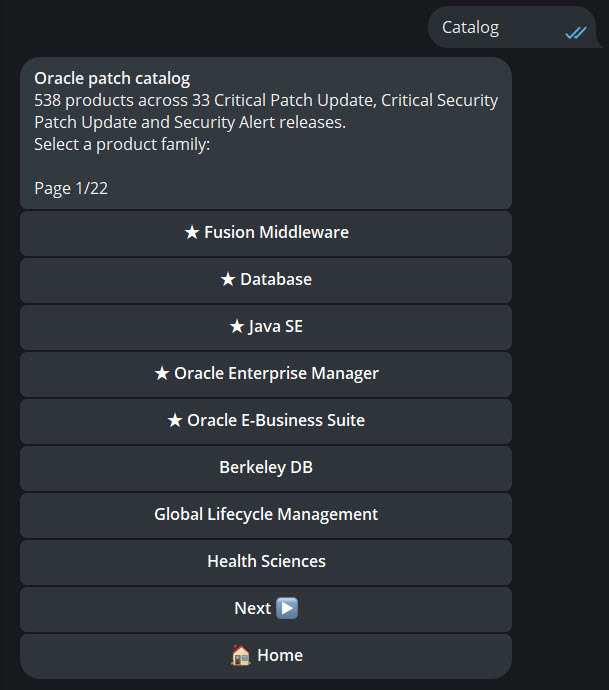
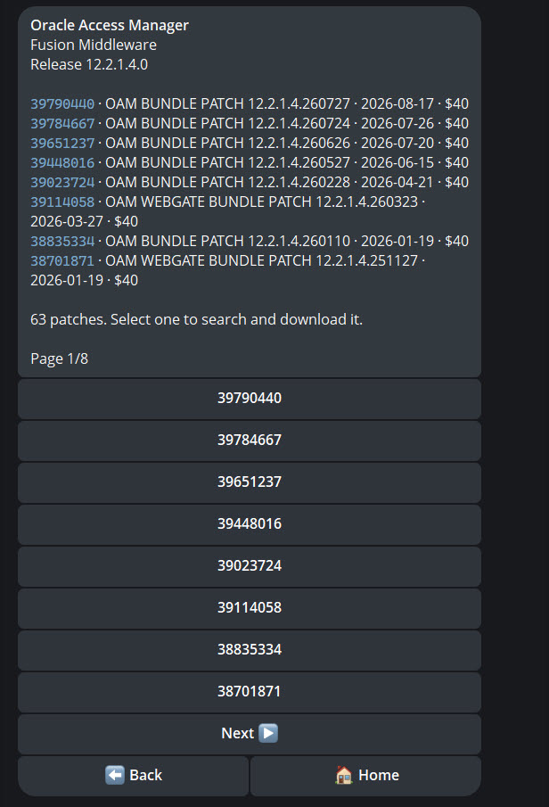
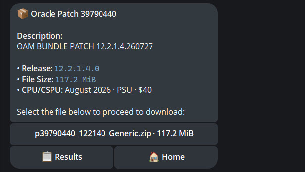

# OraclePD Bot

Telegram channel and bot for Oracle patch updates and critical CVE alerts.

## Disclaimer

> This bot is intended for **independent security researchers and students** who cannot obtain Oracle product patches through official channels, yet still need access to binaries to analyze products and study 1-day CVEs - especially in an era where AI accelerates both vulnerability discovery and exploit development. It is not affiliated with Oracle Corporation. Use only for lawful research and defensive analysis.

## Our channels

| | |
| --- | --- |
| [@oraclepdchannel](https://t.me/oraclepdchannel) | Notifications for bot updates |
| [@oraclepdbot](https://t.me/oraclepdbot) | Download Oracle patches - **$40** each (USDT, BTC, ETH, and more) |

Start with the channel for bot related announcements, then talk to the bot when you need a patch.

## What you get

- **Channel** - new bot news, and related updates as they land
- **Bot** - request and download Oracle patches without digging through support portals. Each patch is **$40**, paid in crypto USDT (TRC-20/ERC-20), BTC, ETH, and more.

## Features

### Catalog

Browse Oracle products by family (Database, Fusion Middleware, Java SE, and more), then drill into a product to see its patches. Each entry shows the **patch ID** and **bug number** so you can copy them into **Search** later and download the patch without hunting through My Oracle Support.

### Search & download

Look up a patch by ID or bug number, then pay **$40** to download it. Accepted payments include **USDT (TRC-20)**, **USDT (ERC-20)**, **BTC**, **ETH**, and other cryptocurrencies.

Happy learning & hacking! ❤️